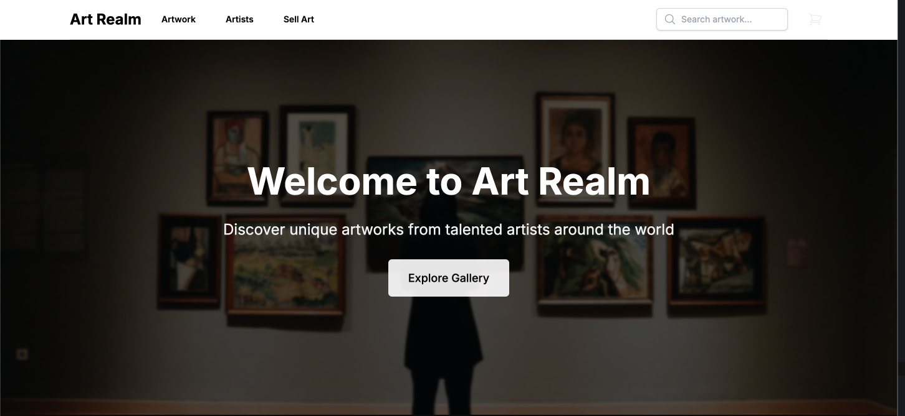

# Art Realm 🎨

Art Realm is a modern, full-stack e-commerce platform for buying and selling artwork. Built with Next.js 14 and styled with Tailwind CSS, it provides a seamless experience for art enthusiasts to discover, purchase, and sell original artwork.



## 🌟 Features

### For Art Enthusiasts

- **Browse Artwork**: Explore a curated collection of original artwork
- **Search & Filter**: Find artwork by category, price range, or artist
- **Detailed Product Pages**: View high-resolution images and detailed artwork information
- **Shopping Cart**: Easy-to-use cart system for purchasing multiple items
- **Responsive Design**: Seamless experience across all devices

### For Artists

- **Artist Profiles**: Dedicated pages for artists to showcase their work
- **Artwork Management**: Easy upload and management of artwork listings
- **Sales Dashboard**: Track sales and manage orders

## 🛠️ Technology Stack

- **Frontend Framework**: Next.js 14
- **Styling**: Tailwind CSS
- **UI Components**: 
  - Headless UI for accessible components
  - Heroicons for icons
- **Type Safety**: TypeScript
- **Deployment**: Vercel

## 📦 Project Structure

```
art-realm/
├── src/
│   ├── app/
│   │   ├── artwork/         # Artwork-related pages
│   │   ├── cart/           # Shopping cart
│   │   ├── search/         # Search functionality
│   │   ├── components/     # Reusable components
│   │   ├── data/          # Mock data and constants
│   │   └── utils/         # Utility functions
│   └── ...
├── public/                 # Static assets
├── package.json           
└── ...
```

## 🚀 Getting Started

### Prerequisites
- Node.js 18.0 or later
- npm or yarn

### Installation

1. Clone the repository:
   ```bash
   git clone https://github.com/d3bn4th/art-realm.git
   ```

2. Install dependencies:
   ```bash
   cd art-realm
   npm install
   ```

3. Run the development server:
   ```bash
   npm run dev
   ```

4. Open [http://localhost:3000](http://localhost:3000) in your browser

## 📱 Key Features Explained

### 1. Homepage

- Hero section with featured artwork
- Grid layout of available artwork
- Quick access to categories

### 2. Artwork Pages

- Individual product pages for each artwork
- High-resolution image display
- Detailed artwork information
- Related artwork suggestions
- Add to cart functionality

### 3. Search & Filter

- Real-time search functionality
- Filter by category
- Sort by price, popularity, etc.

### 4. Shopping Cart

- Add/remove items
- Quantity adjustment
- Price calculations
- Checkout process

### 5. Artist Features

- Artist profile pages
- Artwork management
- Sales tracking

## 🔧 Configuration

### Environment Variables

Create a `.env.local` file in the root directory:
```env
NEXT_PUBLIC_API_URL=your_api_url
# Add other environment variables as needed
```

### Deployment

The project is configured for easy deployment on Vercel:
1. Push your code to GitHub
2. Import the project in Vercel
3. Configure environment variables
4. Deploy

## 🤝 Contributing

1. Fork the repository
2. Create your feature branch (`git checkout -b feature/AmazingFeature`)
3. Commit your changes (`git commit -m 'Add some AmazingFeature'`)
4. Push to the branch (`git push origin feature/AmazingFeature`)
5. Open a Pull Request

## 📝 Future Enhancements

- [ ] User authentication
- [ ] Payment integration
- [ ] Artist dashboard
- [ ] Order management system
- [ ] Review and rating system
- [ ] Wishlist functionality
- [ ] Advanced search filters
- [ ] Social sharing features

## 📄 License

This project is licensed under the MIT License - see the [LICENSE.md](LICENSE.md) file for details.

## 👥 Team

- Arihant Debnath - Initial work - [d3bn4th](https://github.com/d3bn4th)

## 🙏 Acknowledgments

- Next.js team for the amazing framework
- Tailwind CSS for the utility-first CSS framework
- Vercel for hosting and deployment
- All contributors who have helped shape this project

---

For more information or support, please open an issue or contact the maintainers.
